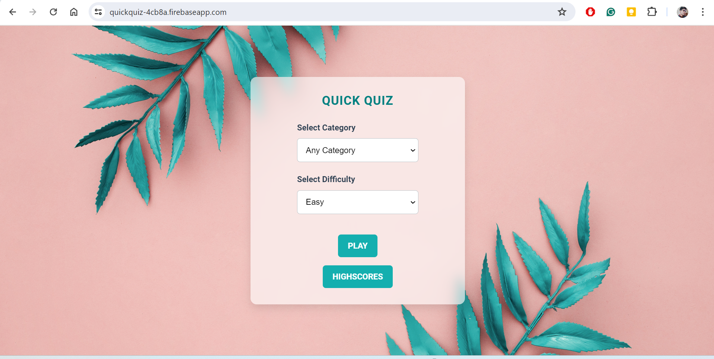
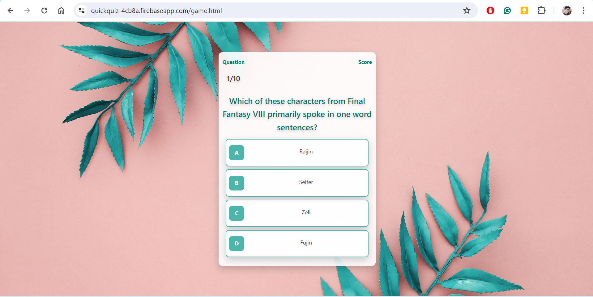
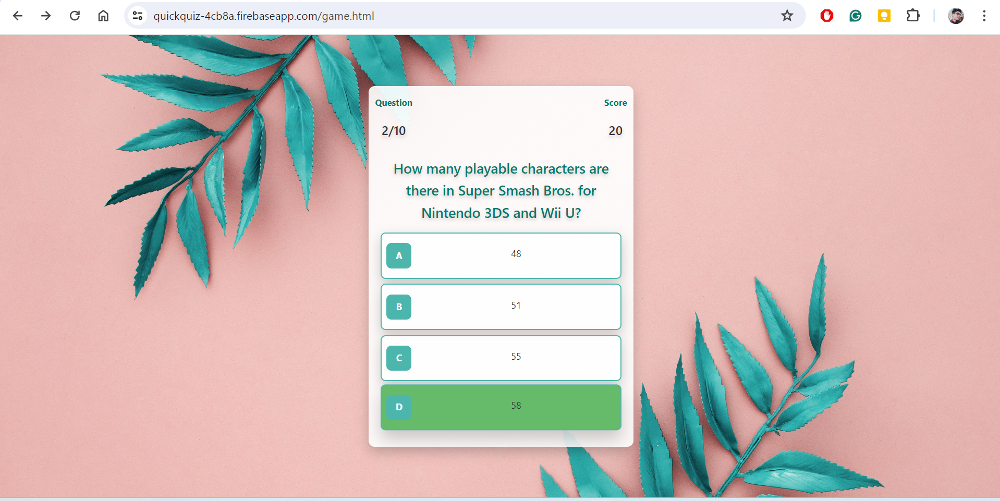
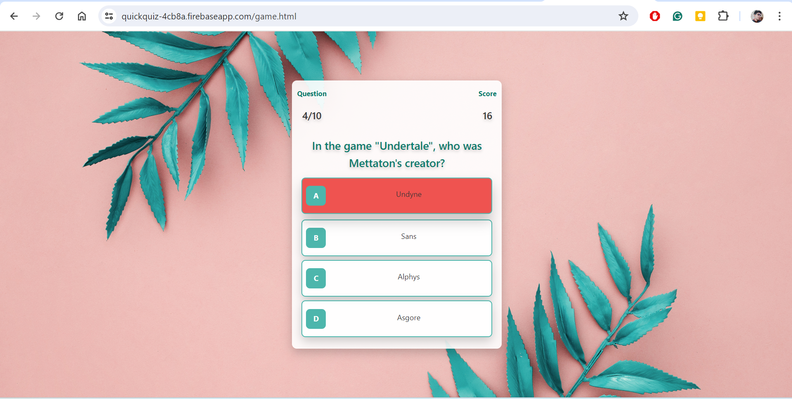
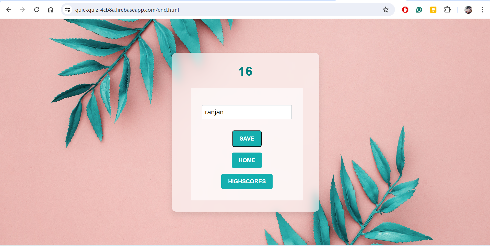
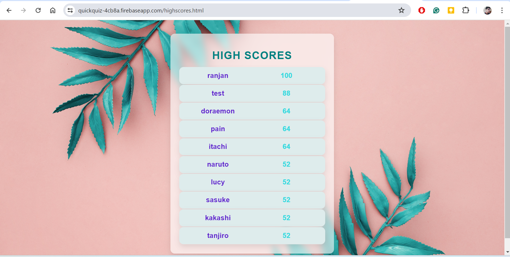

# quiz-web-application
<h2>quickquiz-4cb8a.firebaseapp.com</h2>
<h3>TO FIX:</h3>

questions and choices are coming with some HTML entities(for ampersand, double quote, single quote)

<ul><h3>FEATURES</h3>
  <li>
user can choose one of 24 categories to get questions on that category or can choose "any category" option to get mixed questions from various categories
</li>
  <li>
user can also choose difficulty level of the quiz
</li>
  <li>
quiz will comprise of 10 questions with four choices
</li>
  <li>
user will get a score of +10 on each correct answer and will get -2 on each incorrect one
</li>
  <li>
after answering all the 10 questions, User can save his/her score with entering his/her username
</li>
  <li>
check out top 10 scores in Highscores section with respective usernames
</li>
</ul>
<ul><h3>HAVE A LOOK HERE</h3></ul>
<table>
  <tr>
    <td>HOME PAGE</td>
    <td>QUIZ PAGE</td>
  </tr>
  <tr>
    <td>
    <td>
  </tr>
</table>

<table>
  <tr>
    <td>On choosing correct choice</td>
    <td>On choosing incorrect choice</td>
  </tr>
  <tr>
    <td>
    <td>
  </tr>
</table>

<table>
  <tr>
    <td>End Page</td>
    <td>Highscores page</td>
  </tr>
  <tr>
    <td>
    <td>
  </tr>
</table>
